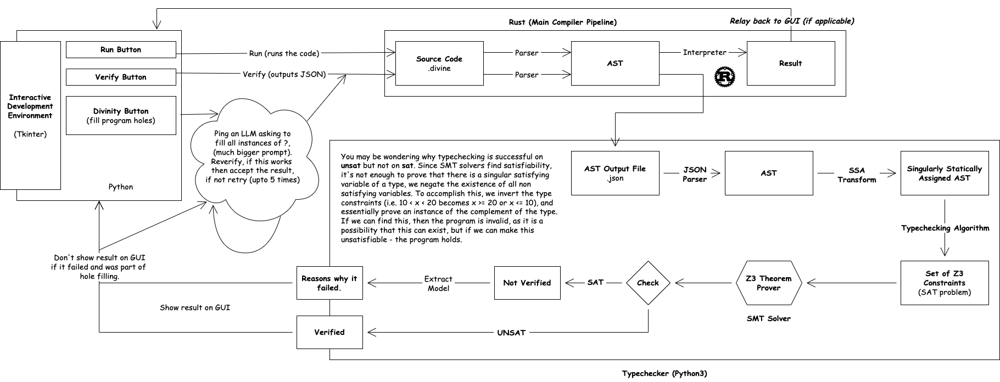

<!-- Improved compatibility of back to top link: See: https://github.com/pull/73 -->
<a name="readme-top"></a>

<!-- PROJECT LOGO -->
<br />
<div align="center">
  <a href="https://github.com/tobybenjaminclark/divinity">
    
  </a>

  <h3 align="center">Divine Intellect Compiler</h3>

  <p align="center">
    🪄 Dependently typed toy language with holes developed in rust for HackSheffield 9! Developed using Rust, Larlpop and Z3!
    <br />
    <br />
    <a href="https://devpost.com/software/divine-intellect-compiler">View Devpost</a>
    ·
    <a href="https://github.com//tobybenjaminclark/divinity/issues">Report Bug</a>
    ·
    <a href="https://github.com/tobybenjaminclark/divinity/issues">Request Feature</a>
  </p>
</div>


<!-- ABOUT THE PROJECT -->
## About The Project

The **Divine Intellect Compiler** brings together *dependently typed* programming and *large language models* (LLMs) in an experimental way. The compiler uses a toy language called Divinity, where developers can write programs with holes (placeholders) for incomplete code. These holes can then be filled in automatically by an integrated LLM, then verified (proved!).

The key feature of Divine Intellect is its ability to **verify** that the code generated by the LLM is correct. Using dependent types and satisfiability checking, the compiler ensures that any LLM-generated code adheres to the constraints you define. For instance, you can create a `BoundedInt` type to enforce that values must always fall within a specific range.

By combining LLM support with formal verification, the Divine Intellect Compiler allows you to generate code while making sure it meets the necessary requirements and constraints, offering an extra level of assurance that the code is working as expected.

Infact, the Divine Intellect Compiler is inspired by Terry Davis' famous [TempleOS](https://en.wikipedia.org/wiki/TempleOS) system, and surrounding projects such as [HolyC](https://holyc-lang.com/), but with a verification twist.

<p align="right">(<a href="#readme-top">back to top</a>)</p>


<!-- USAGE EXAMPLES -->
## Internals & Architecture

<p align="center">
  
</p>
<p align="center">
High Level Compiler Overview
</p>

##### Compiler Frontend (Parsing)
Divine Intellect Compiler, uses [lalrpop](https://github.com/lalrpop/lalrpop), a lightweight language for defining grammars in a concise, declarative style, which builds a parser distinct for the given context-free-grammar. Here's an example of one rule, others can be found in `src/calculator1.lalrpop`.

```rust
pub FunctionDefinition : Block = {
    "fn" <id: IDString> "(" <args: Comma<TypedArgument>> ")" "->" <ret_type: IDString> "{" <stmts: Semicolon<Statement>> "}" => {
        Block::FunctionDefinition(id, args, ret_type, stmts)
    }
}
```

##### Program Verification
After we have obtained the program in it's AST form, we can verify this using [Z3 Theorem Prover](https://github.com/Z3Prover/z3). Firstly, we perform a [Static Singular Assignment (SSA) transform](https://en.wikipedia.org/wiki/Static_single-assignment_form), before we encode the program into Z3 and check it's satisfiability.
- Types are given as expressions, i.e. σ > 10
- Since Z3 checks satisfiability, the complement is encoded, i.e. σ ≤ 10
- We prove the unsatisfiability of the complement, and the satisfiability of the type to prove correctness.


##### Running Code (Interpreter)
The AST is then interpreted directly using a bespoke interpreter written in Rust. This can be found in `src/compile/interpreter.rs`, and supports I/O using `show` and `getint` commands.

<p align="right">(<a href="#readme-top">back to top</a>)</p>

<!-- CONTRIBUTING -->
## Contributing
Since the project was born out of a 24-hour hackathon, there are going to be issues and bugs - note the lack of installation guidance here as an example. If you wish to contribute to Divine Intellect Compiler or Divinity, please feel free to create a feature branch or raise an issue! If you encounter any big issues, or get really stuck - feel free to contact whoever you think is most relevant to the issue you are encountering. 

1. Fork the Project
2. Create your Feature Branch (`git checkout -b feature/AmazingFeature`)
3. Commit your Changes (`git commit -m 'Add some AmazingFeature'`)
4. Push to the Branch (`git push origin feature/AmazingFeature`)
5. Open a Pull Request

<p align="right">(<a href="#readme-top">back to top</a>)</p>


<!-- LICENSE -->
## License

Distributed under the MIT License. See `LICENSE.txt` for more information.

<p align="right">(<a href="#readme-top">back to top</a>)</p>

<!-- CONTACT -->
## Contributors
[Amber Swarbrick](https://github.com/aswarbs) - Compiler Implementation
[Toby Clark](https://github.com/tobybenjaminclark) - Verification Algorithm Implementation


<p align="right">(<a href="#readme-top">back to top</a>)</p>
